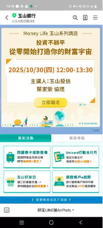
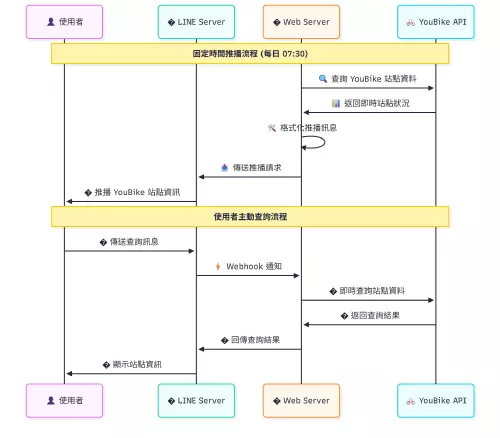
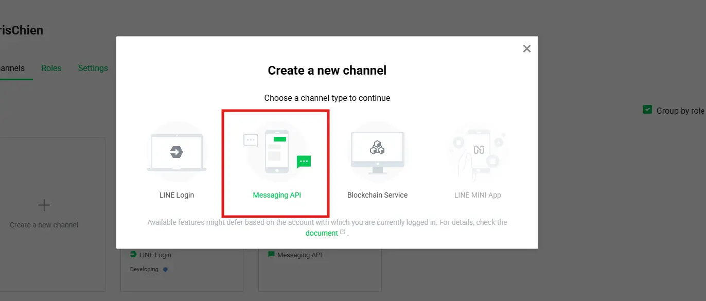
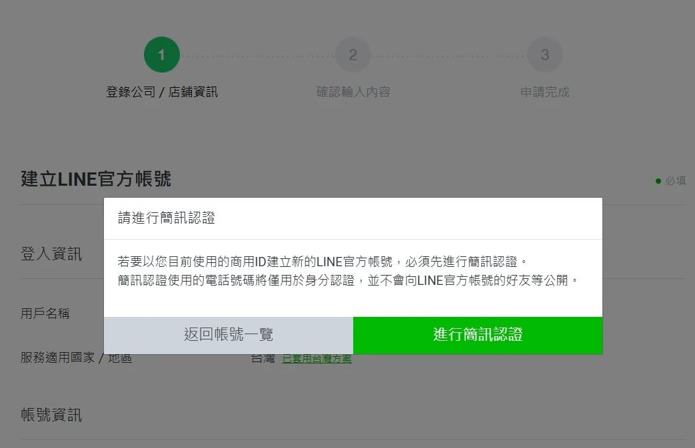
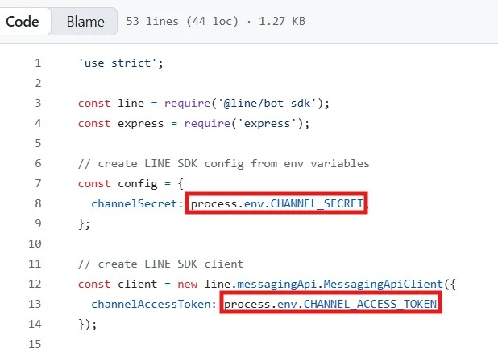
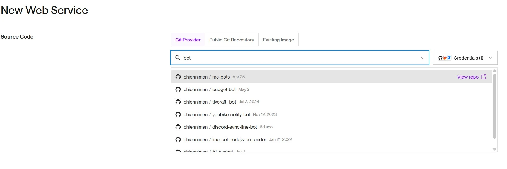
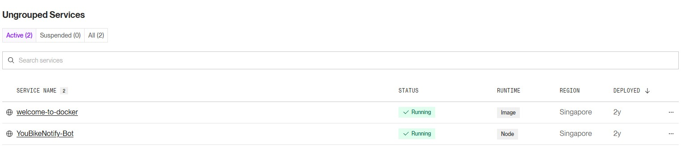
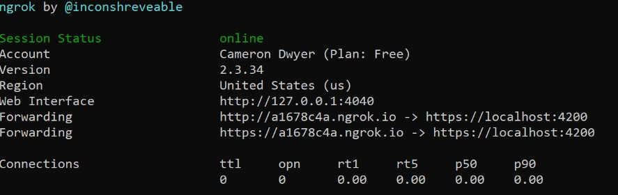
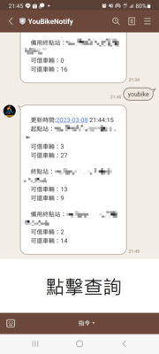

## 為什麼 LineBot 是台灣企業的必備武器？
Line 是台灣最常見的通訊軟體之一，市佔率高達 90% 以上，Messenger、Telegram 都無法與其相提並論，無論是外出購物，講電話，送禮物，都離不開他，獨佔市場的好處是許多商家會透過 Line 提升品牌知名度、觸及目標客群、促進銷售轉換，增加顧客忠誠度，進而達到很好的營銷效果，在這個注意力稀缺的時代，**主動觸達客戶**比被動等待更有價值。LineBot 不只是通訊軟體，更是能創造實際商業價值的利器！

飲料店、銀行、行銷公司都大量使用 LineBot 作為營銷手法，比起投放廣告，將促銷訊息推播給使用者能來更好的效果，看 youtube 時大多數人看到不相關的廣告，第一反應是想趕緊關掉，因為使用者不感興趣，Line推播完全不同，使用者大多數是自願加入官方帳號，後續企業精準投放促銷訊息，以我為例，我有加入玉山銀行的官方帳號，最新的投資訊息就會第一時間送到我的 Line 上，節省了許多查資料的時間，也避開了不相關的廣告。



## 導入 LineBot 能為你的事業帶來什麼？
**能幫使用者省下大量時間或是賺取金錢的就是有價值的服務**，舉個簡單的例子，小明是個高中生早上固定騎youbike上下學，youbike雖然方便，但可能遇到沒車可借或是沒空位可還的尷尬情境，這時候就會浪費大量的時間跑到其他站點借車或是還車，其實微程式公司有開發youbike的官方帳號，讓使用者可以查詢附近站點的可借車輛與可停空位，但這個過程沒辦法自動化，對一個每天固定通勤的人很浪費時間，如果換個思路，小名每天都能在上課、放學前收到附近站點的通知。

## 實際案例1：YouBike bot 通勤助手
YouBike LineBot 採用事件驅動架構，主要包含三個核心功能流程：

當使用者加入機器人或發送訊息時，系統會自動觸發註冊事件，後端伺服器將記錄並儲存重要識別資訊（User ID、Group ID、Chat Room ID）至資料庫，建立用戶檔案以支援個人化服務。

使用者透過 Line 介面點擊查詢按鈕後，請求會經由 Line 官方伺服器轉發至我們的 Webhook API。後端伺服器接收到請求後，立即向 YouBike 官方 API 發送請求，獲取最新的站點資訊（可借車輛數、可還空位數），並將處理後的結果即時回傳給使用者。

使用者可自訂提醒時間，系統會根據設定的排程，主動推播個人化的站點資訊至指定的個人聊天、群組或聊天室，實現真正的「預知式服務」。



## 建立 LINE Bot 頻道
1. 前往 [LINE Developers](https://developers.line.biz/en/)
2. LINE 帳號登入，建立 message API 頻道

3. 登錄公司資訊

4. 確認輸入內容

## 開發 Line Bot
Line 官方提供了大量的範例，千萬不要從零開始造輪子，請直接clone官方nodejs範例
```
git clone https://github.com/line/line-bot-sdk-nodejs.git
```
如果需要其他語言，這邊直接提供連結
[line-bot-sdk-python](https://github.com/line/line-bot-sdk-python.git)
[line-bot-sdk-go](https://github.com/line/line-bot-sdk-go.git)
確保環境變數有設定secret跟accessToken，這兩個分別可以在**Basic settings**跟**Messaging API**找到


## 部署 Line Bot
可以選擇購買雲端主機或是雲平台，想測試了話推薦部署在[Render](https://render.com/)，先從GitHub repo中選擇要推送的儲存庫，，然後設定部署相關資訊，就可以輕鬆建立了，可以在dashbord中成功管理運行中的服務。


## ngrok 讓你有開箱即用的域名與Https
開發完 LineBot 後最頭痛的就是部署問題。辛苦寫好的程式部署到伺服器上，webhook url 會是 http://你的伺服器IP/webhook ，要把這個網址註冊到 LINE 官方伺服器，讓 LINE 知道要把訊息轉發到哪裡。
問題來了，LINE 官方非常龜毛，**只接受 HTTPS 的網址**，如果你的伺服器沒有 SSL 憑證，LINE 會直接拒絕你的 webhook。這也是有道理的啦，畢竟安全性考量，你的 API 對 LINE 來說就是第三方服務，當然要嚴格一點。
如果不使用Render等雲平台，而是選擇雲端機器，這時候就需要利用 ngrok ，把電腦上的 localhost 映射成 HTTPS 的公開網址，而且完全免費。

映射完成後把對外的webhook url貼到Line webhook settings上勁大功告成了，這時候機器人就可以順利接收使用者的指令了。

### 測試機器人
打指令獲得youbike站點資訊


## 為您省下多少錢?
請專案公司開發一個客制化linebot，**報價通常在五萬左右**，但透過Render平台部署 + Ngrok代理伺服器，讓開發者與小型商家能夠用低廉的費用導入並整合linebot服務，如果未來客流量變大，這兩個平台也提供實惠的付費方案，每個月1000以內的費用就能穩定的運行伺服器。

